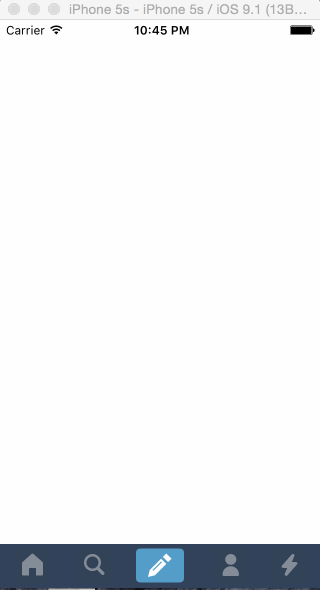

# Tumblr

This is an iOS demo application for a custom navigation bar.  

=====

Time spent: 5-6 hours spent developing, 1.5 hour preparing

Project Requirements
* [x] Tapping on Home, Search, Account, or Trending should show the respective screen and highlight the tab bar button.
* [x] Compose button should modally present the compose screen.
* [ ] Optional: Compose screen is faded in while the buttons animate in.
* [ ] Optional: Login button should show animate the login form over the view controller.
* [ ] Optional: Discover bubble should bob up and down unless the SearchViewController is tapped.

Walkthrough of all user stories:

=======

GIF created with [LiceCap](http://www.cockos.com/licecap/).

